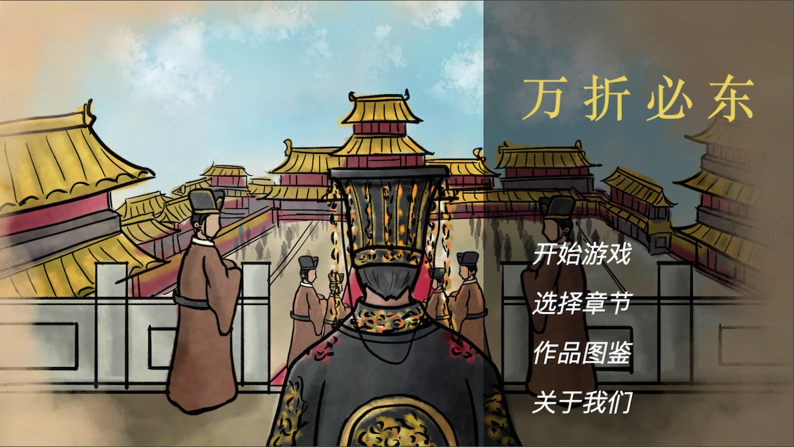
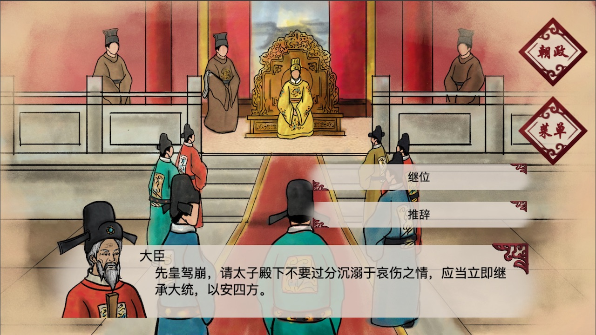
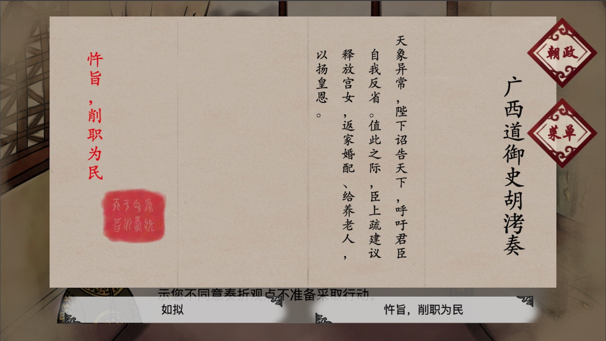

# 万折必东

历史学科教学游戏

## 游戏界面

## 游戏介绍与创作目的

游戏以万历皇帝为玩家第一视角，通过上朝和批阅奏章两个主要活动形式使玩家参与朝廷决策，影响税收、军事、内阁集权程度、皇帝声望四个数值，由此使万历皇帝和明王朝导向若干不同的结局。 

游戏目标是使玩家在游玩的过程中对明朝历史及其政治制度有所了解。使玩家理解万历的成长轨迹及其后期行为的因果关系。从经济、军事、政治、文化多个角度阐释明朝覆灭的历史必然性，以史为鉴，砥砺前行。

## 创作者

本作是清华大学美术学院数字娱乐设计二学位本科毕业设计作品。

* 策划：张硕
* 美术：李丹郁
* 程序：王润基
* 导师：关琰

## 协议

本项目源码按 MIT 协议开源。

美术素材按 CC 署名-非商业性使用（BY-NC） 4.0 协议开源，版权归李丹郁所有。
